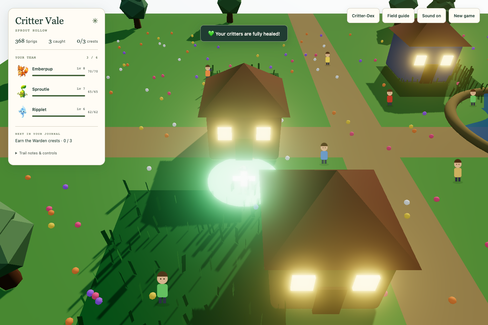
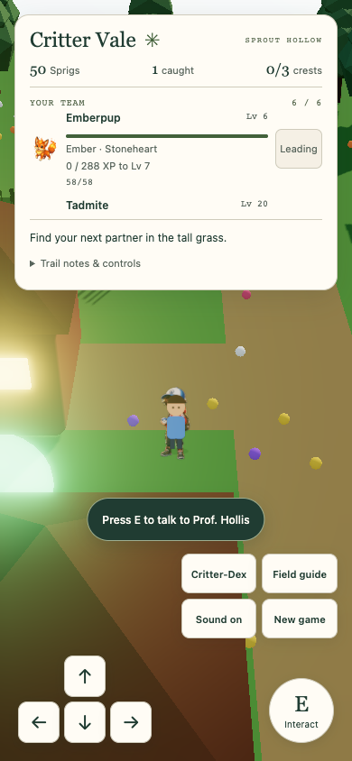
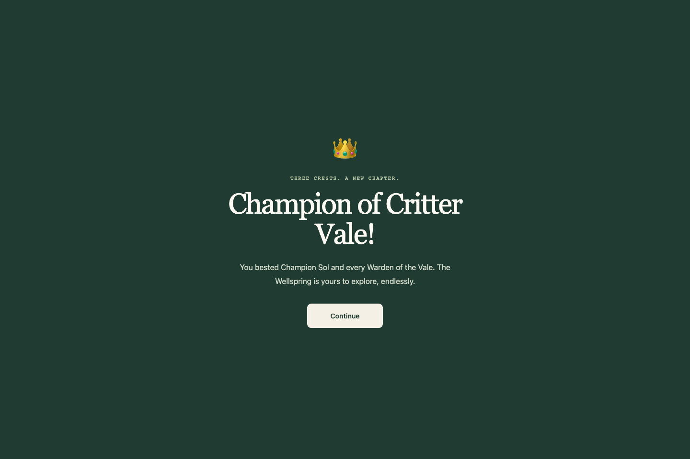

# Gameplay audit — completed scope

Baseline: integrated design branch 80d5f1c (game code also matches isolated checkout 1a2c2ed). This is a game-quality assessment, not another visual score. Browser: real Chrome, isolated local saves. No paid generation, player data, schema changes or main/production changes.

## Evidence and limits

- gameplay-run.cjs drives actual keyboard/click movement and battles with normal RNG, stats, XP, currency and timers. Read-only instrumentation observes position and party/save state; combat reads visible DOM values. Navigation knows the map coordinates, so this cannot measure an unfamiliar human player's discoverability. It chooses the elemental move except when resisted, builds an elemental team, heals and restocks balls. The final policy also purchases ordinary medicine and switches to favorable counters.
- Early harness iterations needed correction: trainer retries were repeated automatically before changing strategy; capture/battle transitions raced locators; returning to an already occupied healing zone did not cross its entry boundary. These are harness limits, not additional game bugs. The run resumed exact previously recorded natural saves; it is not an uninterrupted human session. Early repeated retries and healing visits make raw elapsed totals unsuitable as a clean time-to-completion metric. Final outcome: Champion defeated; see the outcome section below. The first combat policy switched only from a disadvantage and did not restock medicine for Champion attempts. After two Champion losses it was paused at a recorded battle-end checkpoint and resumed the exact earned save with proactive elemental counters, counter-aware forced switches, and normal shop purchases of potions/revives. Those earlier losses do not establish a minimum grind or balanced human difficulty.
- gameplay-balance.json derives XP/move/content facts from the live source. It is a calculation, not a claim that a player must reach Champion's level. Capture/stat fixtures and deterministic RNG in gameplay-regressions.cjs are separate from ordinary-progression observations.
- Figma and Canva connector tools are available. No standalone Magica or Antigravity tools were exposed. The existing game has a Magica-backed API; it was not called. These tools do not establish whether the core progression is fun.
- Qlty 0.622.0 is installed but metrics require a project configuration. No qlty configuration or broad formatting changes were introduced for this audit. TypeScript/Vitest/browser checks remain available.

## Reproduced findings and decisions

| Priority | Finding | Evidence | Decision |
|---|---|---|---|
| High | Capturing gives no XP, defeating gives XP | Actual catch leaves active XP unchanged; failing capture-xp browser regression; throwBall never awards XP | Fix reward omission with existing XP rules, including living bench share and evolution |
| High | No way to choose a healthy lead before a no-switch trial | Battle picks first healthy party member; failing choose-lead regression | Add reversible lead selection to existing party HUD; reuse existing team order/save schema |
| Medium | Escape dismissing trainer dialogue starts combat | Failing escape-trainer regression; close always calls afterDialog | Separate cancellation from completing dialogue; keep normal battle continuation |
| Medium | Potion says it restored 40 HP when only 5 was missing | Failing accurate-healing browser regression | Report actual restored HP |
| Medium | XP can exceed the save validator’s level-100 limit | Two failing unit tests: reward at level100 or across level99 makes progression invalid | Cap earned levels at the existing limit and clear unused max-level XP; tests now pass |
| High | Evolution/progression pacing needs a deliberate balance pass | 3,608 XP from Lv6 to Lv12; estimated 53 wins at uniform capped Lv8–11 wild band (optimistic early, no trainer XP or XP quirk). Wild band stops scaling above party Lv10. | Recommend a bounded shorter progression curve; defer numerical rebalance until end-to-end evidence and approval of gameplay changes |
| High | Move choices mostly collapse to the element triangle | 45 built-in species/target-element comparisons at Lv12: elemental move wins 30; Normal wins the 15 resisted matchups. Enemy always uses slot 0. No status/PP/speed decision in current move model. | Future battle-system work; no new schema or untested mechanics in this patch |
| High | Generated critters lack progression depth | Summons have no evolution, start at Lv7, and share elemental + Normal move pattern; fusion keeps parent A's element and generic moves | Future generation/game-design work; asset volume alone does not solve this |
| Medium | Story, exploration and replay content need deeper assessment | Source has one map, eight NPCs, five one-time trainer challenges, three buildings and 15 built-in species; beaten trainers do not rematch | Record content roadmap after playthrough; new content/removal requires original approval rule |

## Safe implementation direction

Keep the field-journal UI. Make the existing HUD a useful preparation tool: show XP progress and each partner's element/quirk, and offer a clear lead action on healthy benched partners. Preserve current party membership, all HP/XP/traits, save schema, routes and existing content. Hide/disable actions under overlays and for fainted partners. Use the same responsive HUD boundaries and verify full-party touch layouts again.

Fix capture rewards, accidental trainer engagement and inaccurate healing messages. Add a cap regression because the save validator accepts levels through 100 while gainXp currently has no cap. Do not rebalance prices, XP curve, wild bands, enemies or paid generation costs during the ordinary-play baseline.

## Next checkpoints

1. Finish baseline progression or record the exact blocker; do not claim Champion coverage from a high-level fixture.
2. Run failing tests, implement safe fixes, then repeat browser state/touch/journey checks and build/unit suite.
3. Update this document with observed end-to-end outcome, ranked roadmap, screenshots and remaining limits. Keep PR draft; never merge.

## Implemented and verified

Capture and defeat share the existing reward calculation; caught critter HP is preserved. Living bench members earn their existing share, fainted partners earn none, and both active and bench evolutions run after capture. The party HUD offers persistent Lead selection, element/quirk and XP progress without changing save schema. Escape cancels trainer dialogue, potions report actual HP, and XP stops at the validator’s level100 limit. Native Space/Enter on focused controls no longer also interacts with the world.

Verification: 118 unit tests; typecheck; production build; five isolated browser regressions (including active/bench evolution and saved no-switch lead); 60 desktop/mobile states with zero automated WCAG A/AA violations/page errors; four full-party touch layouts with no collisions. No standalone linter is configured, Qlty requires missing project config. Initial post-fix production Lighthouse: title95 mobile/100 desktop, world95/100, accessibility and best practices100 throughout. The quiet recheck measured94, prompting a matched comparison described below. Screenshots in screenshots/gameplay and screenshots/integration are actual Chrome captures. Manual patch review found no changes to generation API guards, dependencies or save format. Automated accessibility does not make the graphical overworld fully accessible to nonvisual players.

## Ordinary-progression outcome

The isolated baseline run earned Leaf, Ember and Aqua crests, defeated Ranger Bex and all three Wardens, then defeated Champion Sol. Final team: Emberwulf16, Bramblor16, Coralux14. The victory screen was loaded and captured in Chrome; Continue returned to exploration and the recorded save has champion=true and all five trainers beaten. No stat/XP/currency grants, teleports or RNG overrides were used in this ordinary run. A resumed save was an exact previously recorded natural checkpoint; the final strategy change paused after battle-end, before further combat. Medicine was bought with earned Sprigs through the Trading Post UI.

The event log contains 200 battle starts, including escapes, repeated early harness retries and training under a weak policy. This is **not** a required battle count, minimum grind, human completion time, or uninterrupted playthrough. Early harness corrections and resumed segments make total timing/turn/catch counters unsuitable for those claims. The final counter/medicine policy won Champion on its first attempt at the existing earned levels; no extra leveling was needed after that policy change. Earlier defeats therefore cannot justify a numerical rebalance on their own. This confirms one normal-progression strategy can finish the baseline; it does not prove every starter/quirk combination or player strategy is balanced. Post-fix ordinary progression was not replayed in full; its changes have targeted and fixture journey coverage.

Evidence: [event log](gameplay-run.json), [earned final save](gameplay-run-save.json), [Champion screenshot](screenshots/gameplay/champion.png). These are isolated synthetic play data, not a real player save. The baseline HUD is pictured in screenshots/gameplay/01-title.png (the filename survived a resumed-run screenshot; it shows the overworld, not the starter screen).

## What should happen next

The result is a more usable, tested small RPG prototype. It is not yet an excellent creature-collecting game. The next work should prioritize meaningful decisions and reasons to explore before asset volume:

1. **Battle depth:** prototype species-specific move choices and enemy decisions that create tradeoffs beyond the current two-move elemental/Normal choice. Validate on representative matchups before changing saved combat contracts.
2. **Pacing:** measure new-player sessions across all starters, including capture XP and deliberate lead rotation. Set encounter/evolution/trial pacing targets from that evidence; the capped wild band and steep XP curve are risks, but this audit does not establish a required new curve.
3. **Collection continuity:** design reserve storage and safe party management so filling six slots does not end collection. Save-schema and destructive release behavior need approval.
4. **Generated creature identity:** define how summoned/fused partners differ in mechanics and grow beyond generic elemental moves. Approve a small paid-service verification budget separately; no generation was purchased here.
5. **World and replay:** add purposeful exploration, quests, rematches and a post-Champion loop with approved progression/content changes. The present content is one map, five one-time trainer challenges and eight wild species.

These are proposals, not implemented features. Risky mechanics, economy/content changes and save work are listed in needs-approval.md. Physical-device, Safari/Firefox and paid-generation checks remain open. Keep PR21 draft; do not merge.

## Screenshot comparisons

| Baseline party HUD | Updated full-party phone HUD |
|---|---|
|  |  |

These show different isolated saves/viewports and establish the visible controls, not a pixel-identical comparison. Both are actual Chrome screenshots. Targeted before/after regression screenshots are in screenshots/gameplay/regression-before-* and regression-after-*; pass/fail assertions in the JSON files establish behavior that a still image alone cannot prove.

## Final performance comparison

The save-seeding tab in the initial Lighthouse script stayed open with a second rendering world. The matched script closes it before measurement and launches fresh Chrome for each alternating baseline/updated run. Mobile baseline measured98/98 performance with161/169ms blocking; updated measured98/97 with164/196ms blocking. Accessibility and best practices100 in all four runs. This does not demonstrate a meaningful gameplay-change regression; a small run-to-run difference remains. No speculative runtime optimization was applied. The initial95 and quiet94 results remain preserved rather than discarded. Updated desktop world measured100; updated title95 mobile/100 desktop, accessibility and best practices100. Title SEO92 and the existing bundle advisory remain the documented limits.

The requested audit/fix scope is complete. The next phase needs deliberate game-design decisions and the approvals listed above; this report does not claim the game is best-in-class. Gameplay changes are committed on design/upgrade, PR21 stays draft, main/production and existing local debugger work remain untouched.
